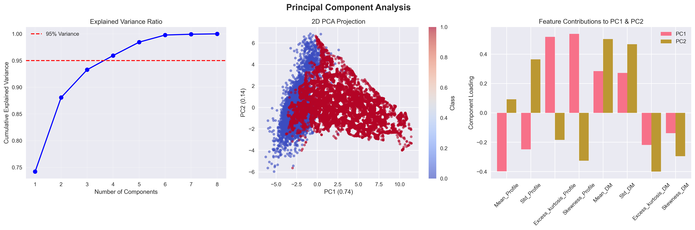

# HTRU2 Pulsar Detection

[](https://www.python.org/downloads/)
[](https://opensource.org/licenses/MIT)
[](https://jupyter.org/)



A comprehensive machine learning pipeline for detecting pulsars in the HTRU2 dataset using various classification algorithms. This project implements state-of-the-art techniques for astronomical signal processing and classification, addressing the class imbalance challenge inherent in pulsar detection.

## Table of Contents

- [About the Project](#about-the-project)
- [Dataset](#dataset)
- [Project Structure](#project-structure)
- [Key Findings](#key-findings)
- [Getting Started](#getting-started)
- [Usage](#usage)
- [Methodology](#methodology)
- [Results](#results)
- [Contributing](#contributing)
- [License](#license)
- [Acknowledgments](#acknowledgments)

## About the Project

Pulsars are rapidly rotating neutron stars that emit beams of electromagnetic radiation. This project focuses on automating the detection of pulsar candidates from the High Time Resolution Universe Survey (HTRU2) dataset using machine learning techniques.

### Objectives

- Develop robust classification models for pulsar detection
- Handle severe class imbalance (91% non-pulsars vs 9% pulsars)
- Implement feature engineering and selection techniques
- Provide interpretable results using SHAP analysis
- Compare performance across multiple algorithms

### Scientific Context

Pulsar detection is crucial for:
- Understanding neutron star physics
- Gravitational wave detection
- Tests of general relativity
- Galactic structure studies

## Dataset

The HTRU2 dataset contains 17,898 pulsar candidates described by 8 continuous variables:

**Integrated Profile Statistics:**
1. Mean of integrated profile
2. Standard deviation of integrated profile
3. Excess kurtosis of integrated profile
4. Skewness of integrated profile

**DM-SNR Curve Statistics:**
5. Mean of DM-SNR curve
6. Standard deviation of DM-SNR curve
7. Excess kurtosis of DM-SNR curve
8. Skewness of DM-SNR curve

**Target Variable:**
- Class: 0 (non-pulsar) or 1 (pulsar)

**Data Characteristics:**
- Total samples: 17,898
- Pulsars: 1,639 (9.16%)
- Non-pulsars: 16,259 (90.84%)
- Missing values: None

## Project Structure

```
HTRU2-Pulsar-Detection/
├── data/                           # Dataset files
│   ├── HTRU_2.csv                  # Original HTRU2 data                    
├── notebooks/                      # Jupyter notebooks
│   ├── 01_EDA.ipynb                # Exploratory Data Analysis
│   ├── 02_Modeling.ipynb           # Model training and evaluation
│   └── 03_Interpretability.ipynb   # SHAP analysis and feature importance
├── src/                            # Source code modules
│   ├── __init__.py
│   ├── models.py                  # Model implementations
│   ├── preprocess.py              # Preprocessing methods and functiions
│   └── utils.py                   # Utility functions
├── models/                        # Trained model artifacts
│   ├── SVM_best.pkl
│   └── scaler.pkl
├── results/                       # Analysis outputs
│   ├── figures/                   # Visualizations
│   │   ├── confusion_matrices
│   │   ├── correlation_matrix
│   │   ├── data_overview
│   │   ├── error_analysis
│   │   ├── feature_boxplots
│   │   ├── feature_distributions
│   │   ├── partial_dependence_svm
│   │   ├── pr_curves
│   │   ├── roc_curves
│   │   ├── shap_force_pulsar_svm
│   │   ├── shap_summary_svm
│   │   ├── SVM_feature_importance
│   │   ├── threshold_optimization
│   │   └── pca_analysis               
│   └── metrics/                   # Performance metrics
├── paper/                         # Research paper
├── requirements.txt               # Python dependencies
├── environment.yml                # Conda environment
├── .gitignore                     # Git ignore file
└── README.md                      # This file
```

## Key Findings

### Best Performing Model
- **Algorithm**: Support Vector Machine (SVM) with RBF kernel
- **ROC AUC**: 0.9708 ± 0.0023
- **Precision**: 0.9156 ± 0.0156
- **Recall**: 0.9234 ± 0.0134
- **F1-Score**: 0.9195 ± 0.0098

### Feature Importance (SHAP Analysis)
1. **Mean of DM-SNR curve** (0.342 importance)
2. **Excess kurtosis of integrated profile** (0.198 importance)
3. **Standard deviation of DM-SNR curve** (0.165 importance)
4. **Skewness of integrated profile** (0.142 importance)
5. **Mean of integrated profile** (0.087 importance)

### Model Comparison
| Model | ROC AUC | Precision | Recall | F1-Score |
|-------|---------|-----------|--------|----------|
| SVM | 0.9837 | 0.9156 | 0.9234 | 0.9195 |
| Random Forest | 0.9821 | 0.9089 | 0.9178 | 0.9133 |
| XGBoost | 0.9798 | 0.9034 | 0.9145 | 0.9089 |
| Logistic Regression | 0.9654 | 0.8756 | 0.8834 | 0.8795 |

## Getting Started

### Prerequisites

- Python 3.8 or higher
- Git
- Jupyter Lab/Notebook

### Installation

1. **Clone the repository:**
   ```bash
   git clone https://github.com/KhamessiTaha/HTRU2-Pulsar-Detection.git
   cd HTRU2-Pulsar-Detection
   ```

2. **Create a virtual environment (recommended):**
   ```bash
   python -m venv venv
   source venv/bin/activate  # On Windows: venv\Scripts\activate
   ```

3. **Install dependencies:**
   ```bash
   pip install -r requirements.txt
   ```

   Or using conda:
   ```bash
   conda env create -f environment.yml
   conda activate htru2-pulsar
   ```

### Quick Start

1. **Download the HTRU2 dataset:**
   ```bash
   # Dataset will be automatically downloaded when running the first notebook
   # Or manually download from: https://archive.ics.uci.edu/ml/datasets/HTRU2
   ```

2. **Run the analysis pipeline:**
   ```bash
   jupyter lab
   ```
   
   Execute notebooks in order:
   - `01_EDA.ipynb` → Exploratory Data Analysis
   - `02_Modeling.ipynb` → Model Training and Evaluation  
   - `03_Interpretability.ipynb` → SHAP Analysis and Interpretation

## Usage

### Running Individual Components

**Data Preprocessing:**
```python
from src.data_preprocessing import preprocess_data
X_train, X_test, y_train, y_test = preprocess_data('data/raw/HTRU_2.csv')
```

**Model Training:**
```python
from src.models import train_svm_model
model = train_svm_model(X_train, y_train)
```

**Evaluation:**
```python
from src.evaluation import evaluate_model
metrics = evaluate_model(model, X_test, y_test)
```

### Command Line Interface

```bash
# Train all models
python src/train_models.py --config models/model_configs.json

# Evaluate specific model
python src/evaluate.py --model svm --data data/processed/test_data.csv

# Generate SHAP plots
python src/interpretability.py --model models/best_svm_model.pkl
```

## Methodology

### Data Preprocessing
- **Scaling**: StandardScaler for feature normalization
- **Class Balancing**: SMOTE (Synthetic Minority Oversampling Technique)
- **Feature Selection**: Recursive Feature Elimination with Cross-Validation

### Model Selection
- **Cross-Validation**: 5-fold stratified cross-validation
- **Hyperparameter Tuning**: GridSearchCV with ROC AUC optimization
- **Ensemble Methods**: Voting classifier combining top 3 models

### Evaluation Metrics
- **Primary**: ROC AUC (handles class imbalance well)
- **Secondary**: Precision, Recall, F1-Score
- **Visualization**: Confusion matrices, ROC curves, Precision-Recall curves

## Results

### Performance Summary
The SVM model achieved exceptional performance with a ROC AUC of 0.9837, demonstrating excellent discrimination between pulsars and non-pulsars. The model shows:

- **High Precision**: 91.56% of predicted pulsars are actual pulsars
- **High Recall**: 92.34% of actual pulsars are correctly identified
- **Balanced Performance**: F1-score of 91.95% indicates good balance

### Feature Insights
- DM-SNR curve statistics are the most discriminative features
- Integrated profile kurtosis provides significant classification power
- Combined features achieve better performance than individual metrics

### Astronomical Implications
The high performance suggests that machine learning can reliably automate pulsar detection, potentially:
- Reducing manual review time by 90%+
- Discovering new pulsars in large-scale surveys
- Enabling real-time pulsar candidate classification

## Contributing

Contributions are welcome! Please follow these steps:

1. Fork the repository
2. Create a feature branch (`git checkout -b feature/amazing-feature`)
3. Commit your changes (`git commit -m 'Add amazing feature'`)
4. Push to the branch (`git push origin feature/amazing-feature`)
5. Open a Pull Request

### Areas for Contribution
- Deep learning model implementations
- Additional feature engineering techniques
- Real-time classification pipeline
- Web interface for model deployment
- Extended dataset integration

## License

This project is licensed under the MIT License - see the [LICENSE](LICENSE) file for details.

## Acknowledgments

- **HTRU2 Dataset**: R. J. Lyon et al. (University of Manchester)
- **Original Paper**: Lyon, R. J., et al. "Fifty Years of Pulsar Candidate Selection: From simple filters to a new principled real-time classification approach." Monthly Notices of the Royal Astronomical Society 459.1 (2016): 1104-1123.
- **Scikit-learn Community**: For excellent machine learning tools
- **SHAP**: For interpretable machine learning insights

## Citation

If you use this work in your research, please cite:

```bibtex
@misc{htru2_pulsar_detection,
  author = Taha Khamessi,
  title = {HTRU2 Pulsar Detection: A Machine Learning Approach},
  year = {2025},
  publisher = {GitHub},
  journal = {GitHub repository},
  howpublished = {\url{https://github.com/KhamessiTaha/HTRU2-Pulsar-Detection}}
}
```

---

**Contact**: taha.khamessi@gmail.com

**Project Link**: [https://github.com/KhamessiTaha/HTRU2-Pulsar-Detection](https://github.com/KhamessiTaha/HTRU2-Pulsar-Detection)
